# IST707: Applied Machine Learning

# Week 2
Professor Joshua Introne
jeintron@syr.edu

# Outline

* Introduction to model evaluation\.
* Supervised
  * Regression Models
  * Classification Models
  * Sampling Methods
* Unsupervised
  * Clustering

# The Importance of Model Evaluation in Machine Learning

Ensures model reliability

Helps in model selection

Identifies model limitations

# Example: Google Flu Trends

---

Data Drift: The behavior of people making search queries can change over time, which may not necessarily correlate with the actual incidence of flu. For example, media hype could lead to an increase in flu-related searches without an actual increase in flu cases.
Overfitting: The model was fine-tuned to the data it was trained on but failed to generalize well to new, unseen data. It was sensitive to the noise and seasonal trends in the training data, which led it to overestimate flu prevalence.
Lack of Domain Knowledge: While the model was data-driven, it could have benefited from incorporating more medical and epidemiological expertise. A more hybrid approach combining data-driven techniques with domain-specific models might have yielded more accurate and reliable results.

# Training Error vs. Generalization Error

__Training Error__  : Error on the data the model was trained on

__Generalization Error__  : Error on new unseen data

__Goal : __  _Minimize training error without increasing generalization error_

# Accuracy is Not Always Enough

Accuracy can be misleading in unbalanced classes

Precision and Recall discriminate between false positive and false negatives

Domain knowledge is crucial for selecting the right metric

# Example: Medical Diagnoses

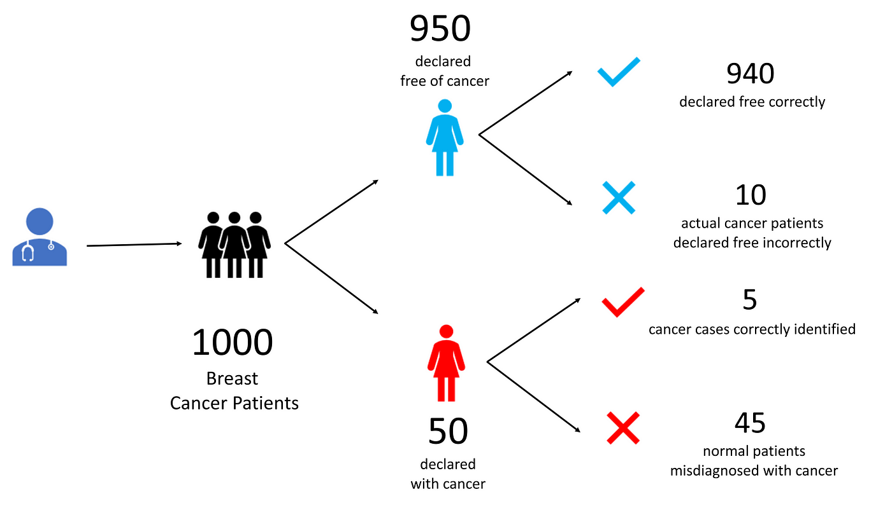

945 / 1000 = 94\.5% accuracy\!\!\!\!

45 / 50 = 90% of patients unnecessarilyalarmed\!

# The Perils of Ignoring Domain Knowledge

Data\-driven doesn’t mean unbiased

Context and domain knowledge are crucial for fair and accurate models

---

Discuss the importance of domain knowledge in machine learning, particularly for tasks that have societal and ethical implications.
Introduce the example of Apple Card, where the credit scoring algorithm reportedly offered lower credit limits to women compared to men with similar financial backgrounds.
Point out that the New York Department of Financial Services launched an investigation into the algorithm.
Although the investigation concluded that there was no intentional discrimination, the incident highlighted the risk of unintentional biases in machine learning models that lack domain oversight.
Conclude by emphasizing the need for domain expertise to guide data selection, feature engineering, and model interpretation to ensure ethical and fair outcomes.

# Takeaways

Rigorous model evaluation is critical\, BUT

Different metrics have different benefits and limitations

Numbers shed light but can obscure important nuances\!

__TAKEAWAY__ : Always use a blend of metrics\, tests\, and domain expertise to truly understand your model's performance and limitations\.

# Evaluating Regressions

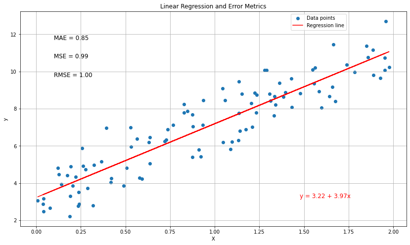

# Common Measures of Regression Accuracy

__Mean Absolute Error \(MAE\)__

__Mean Squared Error \(MSE\)__

__Root Mean Squared Error \(RMSE\)__

---

Mean Absolute Error (MAE)
Interpretability: MAE measures the average absolute errors, making it easy to interpret. One unit of MAE corresponds directly to one unit of the target variable.
Outliers: MAE is more robust to outliers compared to MSE. Outliers have a smaller effect on MAE than they do on MSE.
Linear Errors: Each error contributes linearly to the total error, meaning that all errors are weighted equally.
Mean Squared Error (MSE)
Sensitivity to Outliers: MSE is sensitive to outliers. Large errors contribute quadratically to the total error, which can be either good or bad depending on the specific problem.
Differentiable: The square function is differentiable, which can make optimization easier in machine learning contexts.
Common in Theory: MSE has a strong foundational basis in statistical theory, making it prevalent in many theoretical contexts.
Root Mean Squared Error (RMSE)
Interpretability: Like MAE, RMSE is in the same units as the target variable, making it relatively interpretable.
Sensitivity to Outliers: RMSE is also sensitive to outliers, similar to MSE.
Common in Practice: RMSE is widely used in practical applications where the distribution of error terms is Gaussian and the interest lies in penalizing large errors.
Trade-offs and Considerations
Outliers: If your data contains many outliers, using MSE or RMSE may lead to overestimation of the model's badness-of-fit. MAE is more robust in such cases.
Optimization: If you're using algorithms that rely on gradient descent for optimization, MSE and RMSE are more appropriate because they are differentiable.
Interpretability vs. Sensitivity: If you want a more interpretable metric, MAE might be better. If you want to penalize larger errors more heavily, then MSE or RMSE might be more appropriate.
Domain-Specific: Sometimes the choice of metric is dictated by the domain of the problem. For example, in finance, a small error in predicting a stock's price could result in a significant loss, so you might prefer MSE or RMSE to heavily penalize larger errors.

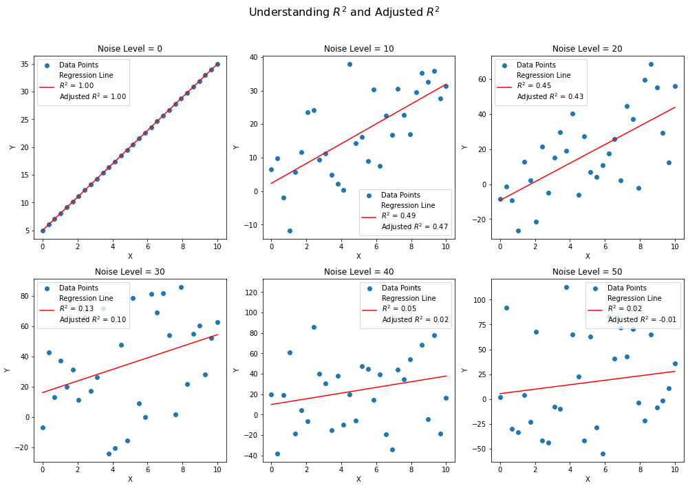

# Coefficients of Determination

R^2 – proportion of variance explained

Adj\. R^2 – adjusted to penalize more covariates

_Number of predictors_

---

R2 measures the proportion of the variance in the dependent variable that is predictable from the independent variable(s).
Ranges from 0 to 1: A higher �2R2 indicates a better fit and explains more of the variability.
Speaker Notes:
Think of �2R2 as the proportion of the response variable that's explained by the model.
While a higher �2R2 is generally better, a perfect �2R2 of 1 is often unrealistic and could indicate overfitting.
Adjusts �2R2 based on the number of predictors in the model, �p, and the sample size, �n.
Unlike �2R2, it penalizes for adding predictors that do not improve the model.
Justification for Adjusted �2R2:
Prevents the "illusion" of a better model when adding more variables.
Provides a more honest picture of the model's explanatory power.
Speaker Notes:
Adjusted �2R2 is especially useful when comparing models with different numbers of predictors.
It helps you make a more informed choice about which variables are truly adding value to your model.

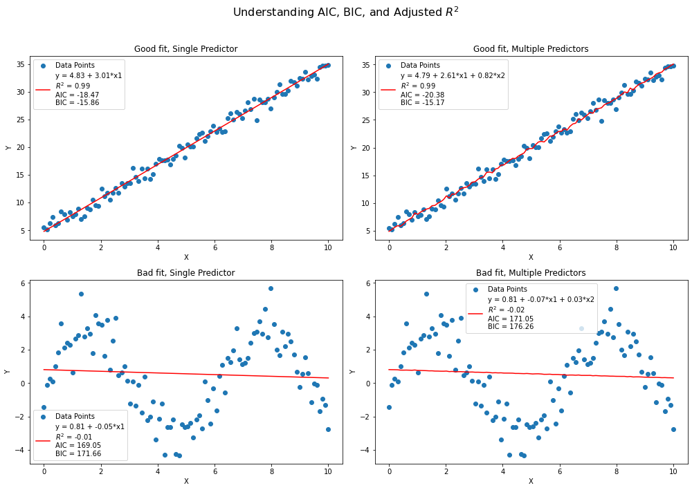

# Model Comparison and selection

* Akaike Information Criterion \(AIC\) and Bayesian Information Criterion \(BIC\)
  * Information theoretic measures balancing fit and model complexity\.
  * Based on likelihood \(L\) of model

_model_

_parameters_

In the case of linear regression\, assuming residuals are normally distributed:

_Normal _  _distribution_

In practice\, it is common to work with log\-likelihood\, because it is easier to work with analytically and numerically

# Akaike Information Criterion

_Number of parameters_

Estimator of the relative quality of the model

Penalty for the number of model parameters

LOWER AIC indicates better fit\, but is a  _relative _ measure

# Bayesian Information Criterion

_Number of observations_

Like AIC\, but penalizes model complexity differently

More conservative about adding parameters as sample size grows; sensitive to overfitting

Focuses on quality of probabilistic model\, rather than predictive accuracy

---

AIC: Focus on Predictive Accuracy
AIC is motivated by a desire for a model that predicts well. It seeks to select the model that will have the best out-of-sample prediction accuracy. The likelihood term in AIC captures how well the model fits the data, while the penalty term discourages overfitting by adding a cost for each additional parameter. AIC doesn't take into account the number of observations directly, which makes it less stringent about adding extra parameters. This might lead AIC to prefer more complex models if those models offer even a slight improvement in fit.
BIC: Focus on Model Selection
On the other hand, BIC is derived from a Bayesian point of view, aiming to find the true model among the set of candidates. It incorporates a penalty term that grows logarithmically with the number of observations, which makes it more conservative about adding additional parameters as the sample size grows. This penalty term reflects a desire to find simpler models that explain the data-generation process well. In a Bayesian framework, simpler models often have higher prior probabilities.
The Key Difference
The key difference lies in their philosophical approaches:
AIC is concerned with predictive accuracy and aims to select a model that minimizes the future prediction error.
BIC is concerned with the goodness of fit and aims to select the model that is most likely to have generated the observed data.

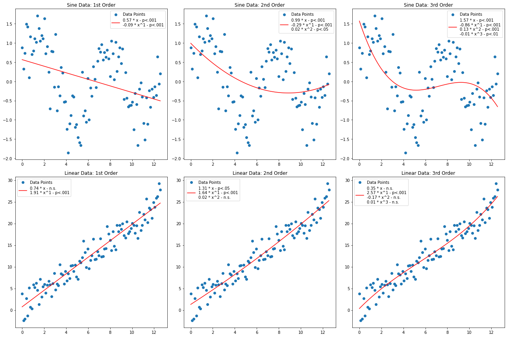

# P-values and significance

A p\-value is a measure of the evidence against a null hypothesis \(e\.g\. the hypothesis that a variable plays a role in a model\)\.

It quantifies the probability of observing a statistic as extreme as the one computed from the sample data\, assuming the null hypothesis is true\.

# Calculating p

For each coefficient β\, the p\-value is calculated using a t\-test

The calculated statistic is compared to the t\-distribution and the p\-value obtained from the area under the distribution

_Number of observations_

_Number of parameters_

# Comparing t-distributions to z-distributions

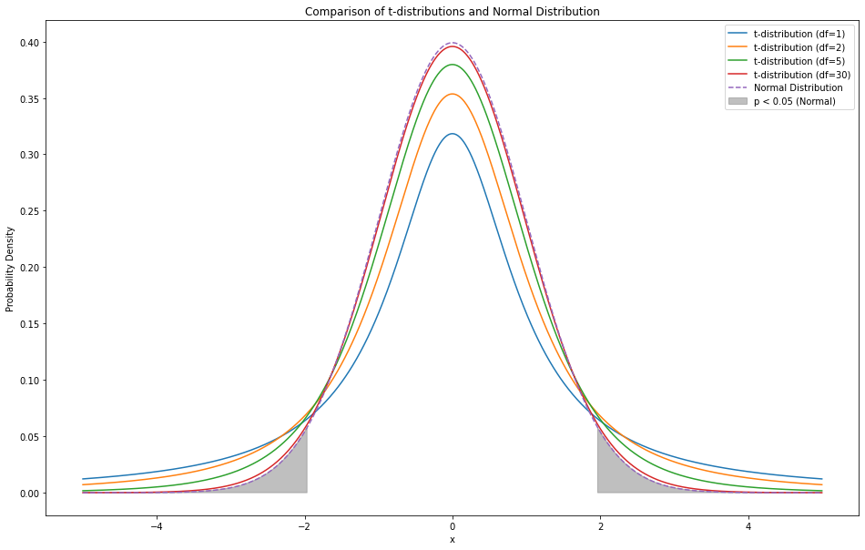

_“Significant” regions_

p > \.05 – not significantp < \.05 – significantp < \.01 – highly significant

---

Explain that a low p-value (< 0.05) indicates that you can reject the null hypothesis. In other words, a predictor that has a low p-value is likely to be a meaningful addition to your model because changes in the predictor's value are related to changes in the response variable.
Conversely, a larger p-value suggests that changes in the predictor are not associated with changes in the response.

# Be careful with p

P\-values reflect the significance of a correlation\, but not a causal relationship or “truth” of a model\!

P\-values do not convey the  _size_  of an effect

Multiple testing can lead to p\-hacking – in other words\, reusing the data to find configurations that achieve a p\-value below the 0\.05 threshold\.

# Evaluating CLASSIFIERS

  # Confusion Matrices

  A  _confusion matrix_  is a table layout that allows visualization of the performance of an algorithm\.

  __True Positives \(TP\)__ : These are the correctly predicted positive observations\.

  __True Negatives \(TN\)__ : These are the correctly predicted negative observations\.

  __False Positives \(FP\)__ : Incorrectly predicted positive observations \(Type I error\)\.

  __False Negatives \(FN\)__ : Incorrectly predicted negative observations \(Type II error\)\.

  # Example

  Online store that sells video games\.

  Model predicts whether a visitor will buy a game or not\.

  Model performance dictates allocation of marketing resources\.

  |   | predictions |  |  |
  | :-: | :-: | :-: | :-: |
  | Ground Truth | buy_game = yes | buy_game = no | total |
  | buy_game = yes | 6700 (TP) | 300 (FN) | 7000 |
  | buy_game = no | 900 (FP) | 100 (TN) | 1000 |
  | total | 7600 | 400 | 8000 |

# Accuracy

Simplest ways to measure the effectiveness of a classification model

For our example:

8\.5 out of 10 times the model correctly predicts whether a customer will buy a computer game or not\.

# However…

* Accuracy can be misleading\, especially when data is “unbalanced”
  * Balanced data is that which has a similar number of examples in each category
  * Otherwise “unbalanced” or “skewed”
* Why is this a problem?

# Accuracy limitations

_Is 85% accuracy a good outcome?_

* __Naïve Model __  __Comparion__  __ – __ In our case\, a “naïve model” \(predicting people purchase a game 100% of the time\) is 87\.5% accurate\!
* __Performance Across Classes __ –
  * The “yes” case \-   6700\(TP\)/7000\(TP\+FN\) ~ 96%
  * The ”no” case – 100\(TN\)/1000\(TN\+FP\) = 10% \!
* __What do we do?__
  * “Impute” data
  * More sophisticated measures \(e\.g\.\, weighted metrics\, Matthews correlation coefficient\, cross\-entropy loss\)

# Precision, Recall, and F1 Score

__Precision: __ Measures how many of the items identified as positive are actually positive\. High precision means low false positive rate\.

__Recall__ : Measures how many of the actual positive cases we caught through our classification\.

\* By Walber \- Own work\, CC BY\-SA 4\.0\, https://commons\.wikimedia\.org/w/index\.php?curid=36926283

# Example

|   | predictions |  |  |
| :-: | :-: | :-: | :-: |
| Ground Truth | buy_game = yes | buy_game = no | total |
| buy_game = yes | 6700 (TP) | 300 (FN) | 7000 |
| buy_game = no | 900 (FP) | 100 (TN) | 1000 |
| total | 7600 | 400 | 8000 |

Precision: 6700/7600 = \.88

Recall: 6700 / 7000 = \.96

F1\-Score:  2\*\(\.96\+\.88\)/\(\.96\*\.88\)=\.92

Precision: 100/400 = \.25

Recall: 100 / 1000 = \.1

F1\-Score:  2\*\(\.25\+\.1\)/\(\.25\*\.1\)=\.14

__Average F1 across classes = \.53__

# ROC and AUC

__ROC \(Receiver Operating Characteristic\) Curve__ : A graphical plot that illustrates the performance of a binary classification system\.

__AUC \(Area Under the Curve\): __ A single number summarizing the overall ability of the test to discriminate between positive and negative classes\.

These measures are constructed by varying the decision threshold for classification\, so not as meaningful in the case of hard classifications

# Example

A probabilistic classifier for predicting diabetes based on blood glucose levels

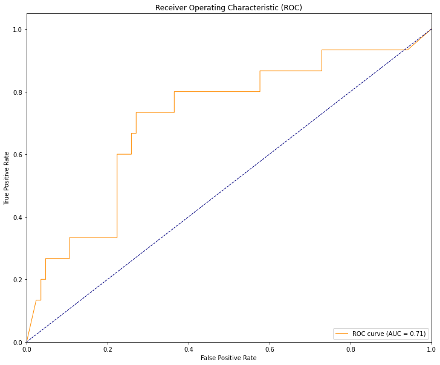

_Area Under the Curve_

---

ROC Curve: The ROC curve allows us to see the trade-off between sensitivity (or TPR) and specificity (1 - FPR). The curve plots TPR vs FPR at various classification thresholds. A model with good classification ability will have a curve that hugs the upper left corner of the plot.
AUC: The AUC is an effective way to summarize the overall diagnostic accuracy of the test. It is a single number that ranges from 0.5 to 1.0, with a higher number indicating better classification performance. A model whose predictions are 100% wrong has an AUC of 0.0; one whose predictions are 100% correct has an AUC of 1.0.

# Calculating AUC

Trapezoidal Rule

N is the number of threshold values – usually the number of unique probabilities in your set of predictions

# SAMPLING METHODS

# IMPUTATION

# Missing Data

In general\, “missingness” refers to missing variables in your data\.

__MCAR \(Missing Completely At Random\)__ : The missingness is entirely random and not related to any observed or unobserved data\.

__MAR \(Missing At Random\)__ : The missingness is random but could be related to some observed data\.

__MNAR \(Missing Not At Random\)__ : The missingness is related to unobserved data or the value itself\.

_Different types of missingness require different strategies_

# Strategies for missing data

__Discard incomplete cases: __ Appropriate for MCAR and possibly MAR\, when data is plentiful\.

__Mean/Median/Mode Imputation__ : Replace missing values with the mean \(for continuous variables\) or mode \(for categorical variables\)\. This method doesn't account for the inherent variability in the data\.  Appropriate for MCAR

__K\-Nearest Neighbors \(KNN\) Imputation__ : Replace missing values with values from "similar" instances\. Appropriate for MCAR\.

__Multiple Imputation__ : Generates multiple imputations for the missing data\, creating several complete datasets\. These datasets are analyzed separately\, and the results are pooled\. Good for MAR and MNAR\.

__Model\-based Imputation__ : Use regression\, decision trees\, or other models to predict and replace missing values\.  Good for MAR and MNAR\.

__Iterative Imputation__ : Impute variables using other variables in an iterative manner\, a popular method being the MICE \(Multiple Imputation by Chained Equations\) algorithm\.  Good for MAR and possibly MNAR\.

# MICE (Multiple Imputation by Chained Equations)

* __Initialization__ : Start by filling in the missing values with a simple imputation method like mean imputation\.
* __Iterative Imputation__ :
  * For each variable with missing data:
    * Set its missing values back to missing\.
    * Model this variable using the other variables\.
    * Use this model to impute the missing values\.
  * Repeat this process for several iterations to make the imputations more robust\.
* __Multiple Datasets__ : This process is repeated to create multiple datasets\, and analyses are performed on each\.
* __Pooling__ : Results from these multiple analyses are pooled together to get final estimates\.

---

Chained Equations: Each variable with missing data gets its own imputation model. This allows for different types of variables (e.g., continuous, ordinal, nominal).
Uncertainty: By creating multiple datasets, MICE captures the uncertainty of missing values, thus providing a more accurate estimate of standard errors.
Flexibility: You can specify different imputation models for different variables.

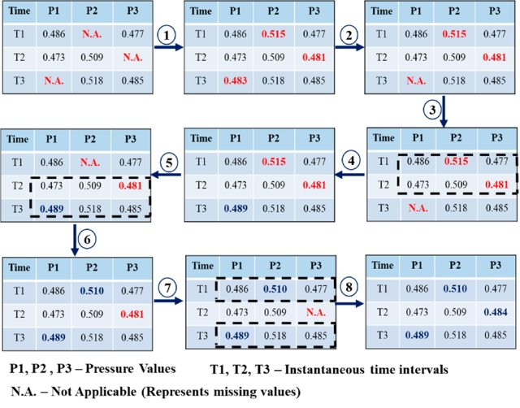

Kim\, Bubryur & Yuvaraj\, N\. & Ramasamy\, Sri & Hu\, Gang & Lee\, Dong\-Eun\. \(2021\)\. Wind\-Induced Pressure Prediction on Tall Buildings Using Generative Adversarial Imputation Network\. Sensors\. 21\. 2515\. 10\.3390/s21072515\.

# MCAR – Mean vs. MICE

# MCAR – Mean vs. Random Forest

# MNAR – Mean vs. MICE

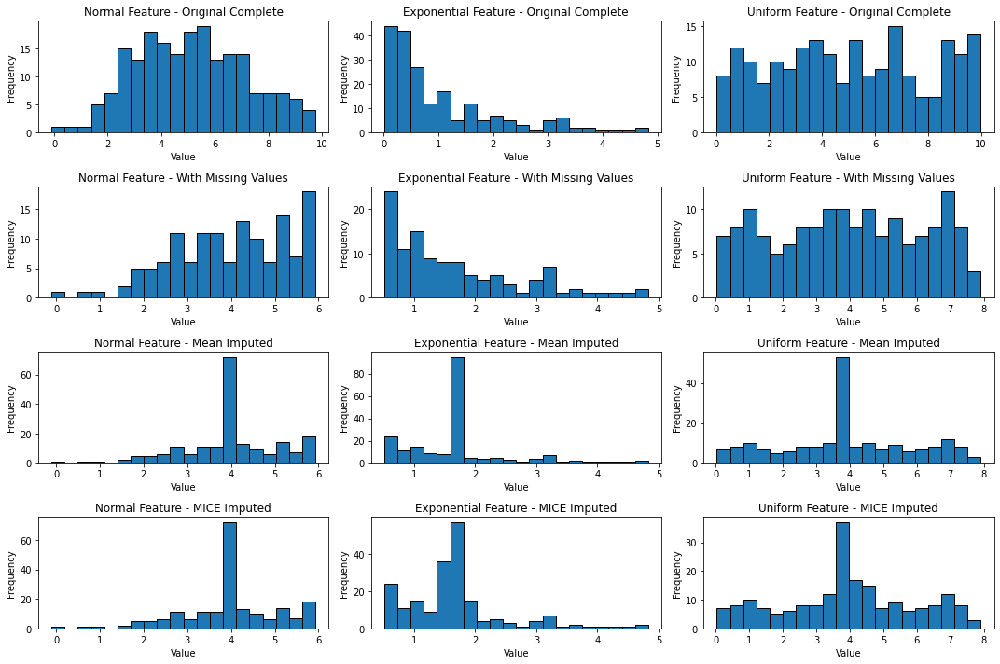

# MNAR – Mean vs. Random Forest

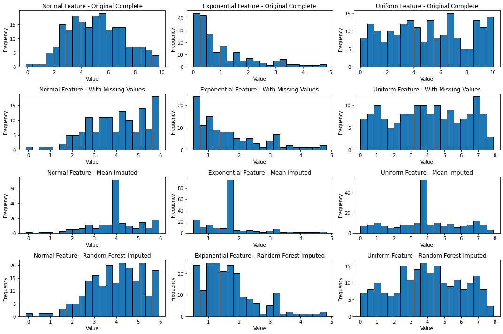

# Considerations for Imputation

* __Model Evaluation__
  * __Evaluate on Complete Cases Only__ : After imputation\, evaluate the model's performance using only the records where the target variable is observed\, and attempt to build validation sets with no missing features\. This ensures that your evaluation is based on actual\, known values\.
  * __Sensitivity Analysis__ : Check how sensitive your model's performance is to different imputation methods\. Train and evaluate your model using different imputation techniques and compare the results\.
  * __Include an "Imputed" Feature__ : Add a binary variable that indicates whether the data was imputed for each record\. This can sometimes help the model account for any potential bias introduced by imputation\.
* __Consider the Impact of the Missing Data__
  * __Importance of the Variable__ : If the variable with missing data \(e\.g\.\, gender\) is crucial for the prediction task\, imputation becomes even more critical\. In such cases\, more advanced imputation methods might be worth exploring\.
  * __Amount of Missing Data__ :  High levels of missing data can make imputation more challenging and can increase the potential for bias\.
* __Transparency and Reporting__
  * Always document and report the percentage of missing data\, the imputation method used\, and any sensitivity analyses conducted\. Transparency is key\, especially when the model is used for decision\-making\.

---

Conside

# Cluster evaluation

# Generally speaking, there is no truth

Clustering is an unsupervised machine learning task that aims to group similar data points together\. Since there's no "ground truth" to compare against\, evaluating the effectiveness of a clustering method can be challenging\.

__Data\-Driven Methods__ : Algorithms and metrics like the Elbow method\, Silhouette Analysis\, and Davies\-Bouldin Index provide a quantitative way to evaluate clustering\. These methods are useful but only offer heuristics\.

__Multiple Metrics__ : It's advisable to use more than one evaluation metric to get a comprehensive understanding of the clustering's performance\.

__Visual Inspection__ : Visualization tools can offer an intuitive understanding of the clustering results\, allowing for easy identification of patterns or anomalies\.

__Domain Knowledge__ : Often\, the "best" number of clusters is guided by domain\-specific knowledge rather than just data\-driven methods\.

# The Elbow Method

One of the most popular techniques for determining the optimal number of clusters\. It involves running the clustering algorithm for a range of cluster numbers and calculating the sum of squared errors \(SSE\) for each\.

__Sum of Squared Errors__

_Cluster centroid_

_Distance \(Euclidean\)_

_1 if _  _x\_i_  _ belongs to j\, else 0_

---

How to Use the Elbow Method
Run Clustering: Perform clustering for different numbers of clusters
Calculate SSE: Compute the sum of squared errors for each clustering.
Plot SSE vs �k: Create a scree plot where the x-axis represents the number of clusters and the y-axis represents the corresponding SSE.
Identify the Elbow: Look for the point where the SSE starts to decrease more slowly, resembling an "elbow."
Limitations
Does not always provide a clear "elbow," making it ambiguous.
Not useful for data that inherently does not cluster well.

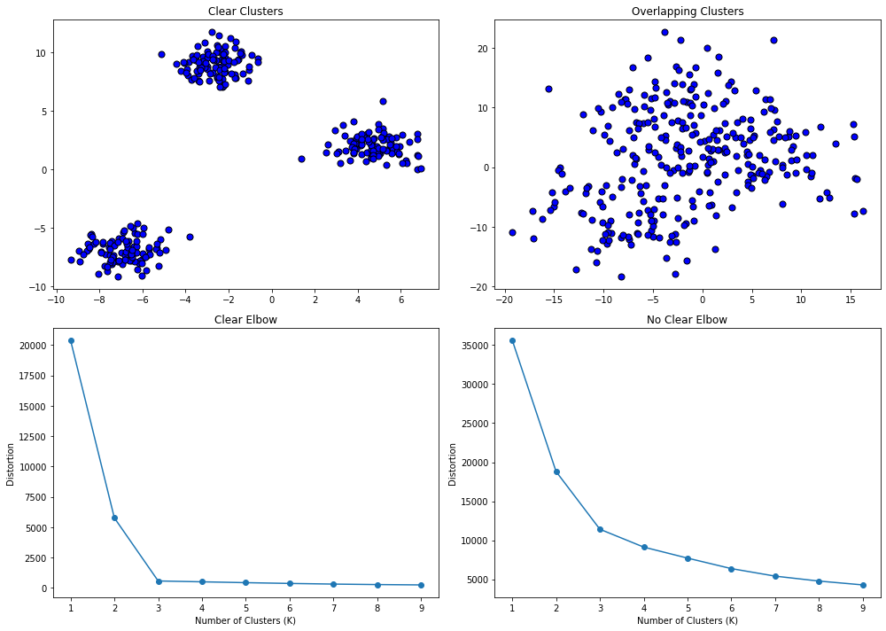

# Silhouette Analysis

Silhouette Analysis provides insight into the separation distance between the resulting clusters\. More distant clusters lead to better clusterings\.

Silhouette Scores for each data point

_Lowest avg\. distance_  _to points in other clusters_

_Average distance_  _points in same cluster_

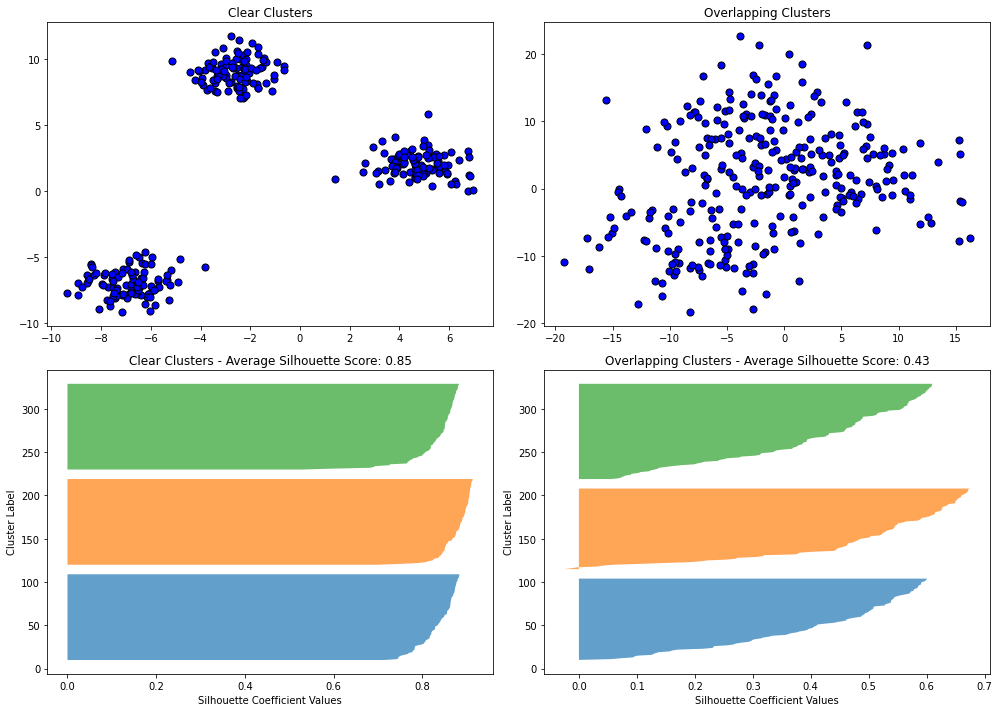

---

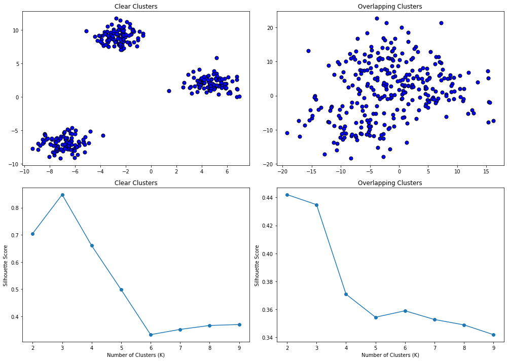

---

# Davies-Bouldin Method

The Davies\-Bouldin Index is another metric used to evaluate the quality of a clustering algorithm\. Unlike the Silhouette Score\, lower values of the Davies\-Bouldin Index indicate better clustering\.  Calculation is:

Within\-cluster Distance:

Between\-cluster Distance: For each pair of clusters i\,j\, calculate distance d\(c\_i\,c\_j\) between centroids\.

Davies Bouldin value for a Pair\.

Maximal DB value for each Cluster:

Average over all clusters:

_Centroid for each cluster_

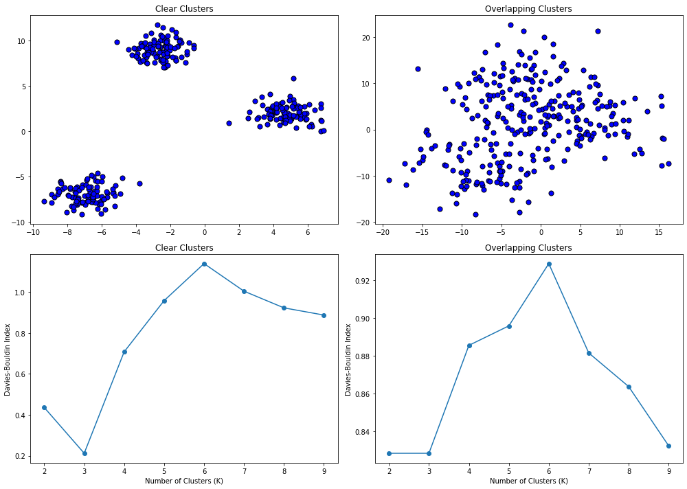

# Visualizing high dimensional clustering

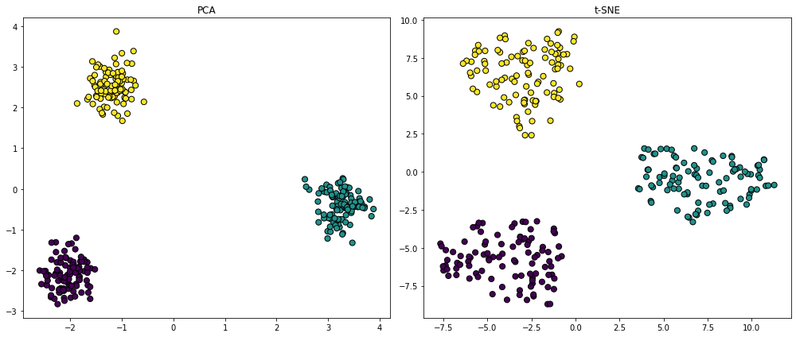

* Visualizing high dimensional data presents a challenge\, because more than 3 dimensions cannot be readily examined
* One strategy is to reduce the dimensionality using PCA\, tSNE\, or UMAP\.
* Considerations:
  * Always standardize your data before reducing dimensionality\!
  * Try different techniques – different dimensionality reduction schemes optimize for different things\, yielding different views\.
  * Always pair visualization with other methods

# Comparing clusterings

* Sometimes it is useful to compare different clusterings
  * When the “truth” is in fact known
  * When comparing clustering methods\, parameters\, etc\.
* Several methods are available\, including the Adjusted Rand Index and Variation of Information score\.

# Adjusted Rand Index

* A measure of the  __similarity__  between two data clusterings\, adjusted for chance\.
* Takes values between \-1 and 1\.
  * ARI = 1: Perfect match
  * ARI > \.65: Marginally acceptable
  * ARI = 0: Random clustering
  * ARI < 0: Poor clustering
* Does not require the same labels\, or even the same number of clusters

* It is possible to calculate a p\-value for ARI\, as follows:
  * __Compute the ARI for your actual data__ : This will be the value you're testing for significance\.
  * __Random Permutations__ : Shuffle the labels of one of the two clusterings \(either true or predicted\) randomly\, while keeping the other clustering fixed\. Compute the ARI for each of these permuted sets\.
  * __Generate a Null Distribution__ : Repeat step 2 a large number of times \(e\.g\.\, 1000 or 10\,000 times\) to generate a distribution of ARI scores that you would expect to see purely by chance\.
  * __Calculate p\-value__ : The p\-value is the proportion of permuted ARIs that are greater than or equal to the observed ARI\. A small p\-value indicates that the observed ARI is significantly different from what would be expected by random chance\, thus suggesting that the clustering is meaningful\.

# Stability Analysis

Imagine you're trying to group your friends based on their favorite types of movies\. If you ask them today and group them\, you might find clear clusters: the action movie lovers\, the rom\-com aficionados\, and the horror fans\.

__Stable Scenario__ : If you ask them again a week later and they give you almost the same answers\, leading to almost the same groups\, your clusters are stable\.

__Unstable Scenario__ : On the other hand\, if you find that the groups change dramatically\, maybe because you realized you forgot to consider documentaries and dramas\, then your initial clustering would be considered unstable\.

In both scenarios\, stability analysis would help you assess how reliable your clusters are over time or against minor changes in the dataset\.

---

Other examples include trying to cluster many many points, or when doing dimensionality reduction *before* clustering.

The general idea here is to calculate cluster assignments over multiple instances and then compare adjacent clusterings\.

When instances follow an original parameter range\, looking for a “plateau” can help identify a decent parameter range

# Stability Analysis Considerations

* Very good with lots of data
  * Too much to cluster at once\, so take multiple samples\!
* General; informative for any clustering technique
* Provides a general sense of algorithm performance
* Does NOT necessarily guide you to the “truth”

